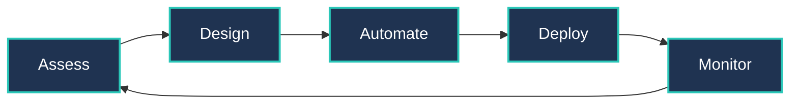

# 🛡️ SecDevOpsPro

<div align="center">


**Secure by Design. DevOps Engineered.**

[](https://secdevopspro.com)
[](https://www.linkedin.com/company/secdevopspro)
[](mailto:contact@secdevopspro.com)

</div>

---

## 🎯 Who We Are

**SecDevOpsPro** is a specialized DevOps consultancy based in **Bulgaria (EU)** that transforms how organizations build, deploy, and secure modern infrastructure. We don't just integrate security into DevOps — we **engineer it from the ground up**.

```ascii
┌────────────────────────────────────────────────────────────┐
│  Speed + Security + Automation = Your Competitive Edge    │
└────────────────────────────────────────────────────────────┘
```

---

## 🚀 What We Deliver

We architect **production-grade infrastructure** with security, scalability, and automation at the core:

### 🔧 Infrastructure & Automation
- **CI/CD Pipeline Design** – GitLab CI, GitHub Actions, Jenkins, ArgoCD
- **Infrastructure as Code** – Terraform, Ansible, Pulumi, CloudFormation
- **Configuration Management** – Automated, version-controlled, auditable infrastructure

### ☸️ Cloud-Native Architecture
- **Kubernetes Orchestration** – EKS, GKE cluster design, scaling & security
- **Container Security** – Image scanning, runtime protection, policy enforcement
- **Microservices Deployment** – Service mesh, observability, resilience patterns

### ☁️ Multi-Cloud Strategy
- **Cloud Platform Expertise** – AWS, GCP multi-cloud deployments
- **Hybrid Infrastructure** – Seamless on-premise + cloud integration
- **Cost Optimization** – Right-sizing, reserved instances, intelligent scaling

### 🔐 Security-First DevOps
- **Automated Security Scanning** – SAST, DAST, SCA integrated into pipelines
- **Compliance Automation** – GDPR, SOC 2, ISO 27001 compliance frameworks
- **Zero-Trust Architecture** – Identity-based access, least-privilege principles

---

## 💡 Our Methodology



**1. Assess** – Deep-dive into your current infrastructure, pain points, and goals  
**2. Design** – Architect solutions tailored to your tech stack and compliance needs  
**3. Automate** – Build CI/CD pipelines, IaC templates, and automated security checks  
**4. Deploy** – Execute phased rollouts with zero-downtime migrations  
**5. Monitor** – Continuous improvement through observability and optimization

---

## 🛠️ Tech Stack We Master

<div align="center">

### Cloud Platforms


### Container & Orchestration


### Infrastructure as Code


### CI/CD & Automation


### Monitoring & Observability


</div>

---

## 📊 Why Choose SecDevOpsPro?

| **Metric** | **Impact** |
|------------|------------|
| ⚡ **Deployment Frequency** | 10x faster releases with automated pipelines |
| 🛡️ **Security Posture** | 98% reduction in critical vulnerabilities |
| 💰 **Infrastructure Costs** | 30-40% savings through optimization |
| 🔄 **Mean Time to Recovery** | <15 minutes with automated rollbacks |
| ✅ **Compliance Readiness** | 100% audit-ready infrastructure |

---

## 🌍 Trusted By

We've partnered with innovative companies across **Europe** to transform their infrastructure:

- **[Futurmille](https://futurmille.com/)** – Modernized cloud infrastructure with Kubernetes migration
- **50+ Projects Delivered** – From startups to enterprise deployments
- **24/7 Support** – Round-the-clock monitoring and incident response

---

## 📚 Knowledge Hub

We believe in sharing expertise to elevate the entire DevOps community:

🎓 **Upcoming:** Technical blog posts on Kubernetes security, Terraform best practices, and multi-cloud architecture patterns

⭐ **Star our repos** to stay updated with our open-source contributions and infrastructure templates!

---

## 🤝 Let's Build Together

Whether you're migrating to the cloud, scaling Kubernetes clusters, or automating your entire deployment pipeline — **we're here to engineer your success**.

### 📞 Get in Touch

- 🌐 **Website:** [secdevopspro.com](https://secdevopspro.com)
- 💼 **LinkedIn:** [linkedin.com/company/secdevopspro](https://www.linkedin.com/company/secdevopspro)
- 📧 **Email:** [contact@secdevopspro.com](mailto:contact@secdevopspro.com)
- 🏢 **Location:** Sofia, Bulgaria (EU) | UIC: 207603791 | GDPR Compliant

---

<div align="center">

### 💬 *"We don't slow down DevOps with security — we accelerate it with trust."*

**🔒 Secure by Design. ⚙️ DevOps Engineered. 🚀 Deployed at Scale.**

---

<sub>© 2025 SecDevOpsPro · All Rights Reserved · Engineered for Security</sub>

</div>
